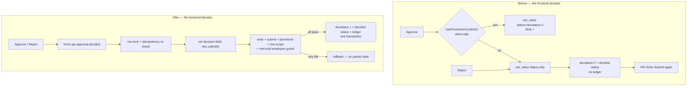

# Plan — one approval action reaches the final state (Leave Application lifecycle)

Branch `nz-version-16`, HEAD `2f0b738fb`, clean, in sync with `origin/nz-version-16`.
Bench `/home/nabil/verify-bench` (`fresh.local`, `test.local`).

## Reproduced, on `fresh.local`, synthetic personas only

| Case | What the UI sends | docstatus | status | ledger |
|---|---|---|---|---|
| A approve, named approver | `{status: Approved, docstatus: 1}` | 1 | Approved | 1 |
| **B reject, named approver** | `{status: Rejected}` | **0** | Rejected | **0** |
| **C status-only approve** | `{status: Approved}` | **0** | Approved | **0** |
| C then redundant HR submit | `{docstatus: 1}` | 1 | Approved | 1 |
| D unrelated approver | denied outright (`{None: 0}`) — fence holds |
| E double coupled approve | idempotent, ledger stays 1 |

B and C are HR's complaint. B happens on **every rejection**, for every persona.

## Root cause

The decision→final-state coupling lives in the **frontend**, in
`RequestActionSheet.vue::updateDocumentStatus`:

```js
if (status === "Approved" && hasPermission("submit")) docstatus = 1
```

Three defects in one line:

1. **Asymmetric.** Only `Approved` is coupled, so a rejection always parks at
   `docstatus 0`, and the sheet then renders its separate Submit button — the redundant
   HR step HR reported.
2. **Client-decided.** The coupling depends on a client-side read of
   `frappe.client.get_doc_permissions`, which runs the fork's `approval_row_scope`
   `has_permission` hook per document. When that returns `submit: 0` — or simply has not
   loaded yet — the approval silently degrades to a half-transition with no error.
3. **Not centralized.** Nothing server-side requires a decided document to reach
   `docstatus 1`, so Desk, REST and any other caller reproduce the same half-state.

Evidence that "decided + draft" is not a legal resting state, from the schema and the
controllers rather than from intent:

* `Leave Application.on_submit`: *"Only Leave Applications with status 'Approved' and
  'Rejected' can be submitted"*;
* `status` is `permlevel 1`, `reqd`, `no_copy`, and **not** `allow_on_submit` — so the
  decision cannot be made after submission; it must ride the same save;
* **no Workflow exists** on Leave Application (`frappe.get_all("Workflow", ...)` is empty
  and the table has no `workflow_state` column), so this is not a workflow-mapping defect;
* `Leave Approver` holds level-0 `submit` **and** permlevel-1 `write` in both DocPerm and
  Custom DocPerm — so the approver can always complete the transition; the frontend was
  simply not asking them to.

Two sibling doctypes carry the identical contract and the identical bug, through the same
component: `Shift Request.on_submit` (*"Only Shift Request with status 'Approved' and
'Rejected'..."*) and `Expense Claim.on_submit` (*"Approval Status must be 'Approved' or
'Rejected'"*).

## Fix

**New `hrms/api/approval.py::decide(doctype, name, status)`** — one whitelisted, POST-only
backend transition for the three decide-then-submit doctypes. It takes a row lock,
re-checks under it, sets the decision field and calls `doc.submit()`, so one authorized
action performs decision + finalization + ledger in **one Frappe save cycle and one
transaction**. Permissions stay entirely with Frappe: `check_permission("write")`,
`check_permission("submit")`, permlevel enforcement on the decision field, the
`approval_row_scope` `has_permission` hook, and `before_submit` →
`block_transactions_for_mirrored_employee`. No `ignore_permissions`, no `db_set`, no flags.

Idempotent by construction: already decided the same way → no-op success; decided
differently, or cancelled → refused.

**`RequestActionSheet.vue`** calls `decide` for those doctypes instead of assembling a
`set_value` payload, deleting the asymmetric client-side coupling. The submit/cancel paths
are untouched. The existing Submit button stays as the repair path for rows already stuck
in the half-state.

## Existing inconsistent records

Reported, **not** auto-submitted: submitting one writes Leave Ledger Entries and consumes
balance, and whether a stale "Approved but draft" row was a real decision or an abandoned
click is not knowable from the data. `hrms/api/approval.py::report_half_transitioned()`
returns the counts and the exact rows for HR to rule on.

## FLOW



## MOCKUP

MOCKUP: NOT NEEDED (no new UI — no screen, route, component or control is added; the
Approve and Reject buttons keep their exact appearance and position, and the only visible
change is that one tap now finishes the document instead of revealing a second Submit
button).

## EXPECTED OUTPUT

**UI result** — an approver taps Approve (or Reject) once and the request reaches its
final state; the Submit button that used to appear afterwards no longer does, because
there is nothing left to submit. A denial now surfaces the server's reason in the existing
toast rather than silently leaving a half-approved document.

**Code changed** — new `hrms/api/approval.py` and `hrms/tests/test_leave_approval_lifecycle.py`;
`frontend/src/components/RequestActionSheet.vue`;
`docs/discovery/as-hr-kpi-to-v16-migration-plan.md`.

**How it ships** — one commit on `nz-version-16`, pushed. No patch and no data migration:
the fix governs future transitions, and historical rows are reported for an HR decision.

**Verification** — new lifecycle suite covering draft → submit → authorized approval →
canonical final state, no second submission, exactly-once ledger, duplicate/retried
approval, unauthorized and cross-company denial, rejection, cancellation, amendment,
mirrored/source-owned refusal, and rollback on a failing downstream step. Regression:
leave application, leave ledger, leave balance, approval row scope, manager visibility,
company fence, write-block, identity, sync, staff lockdown, PWA tests, static suites,
ruff, compileall, frontend build, fresh + upgraded + repeat migration, `git diff --check`.

## Guardrails

Only `nz-version-16`. `version-16`, `version-15`, `as-hr_kpi` read-only. No force-push, no
PR. No `ignore_permissions`, no direct DB writes and no flag manipulation to bypass
lifecycle events. None of the existing protections — draft creation, approver fence,
single approver source of truth, company fence, row scope, ledger dual-write block,
identity resolution — is weakened. Synthetic data only.
