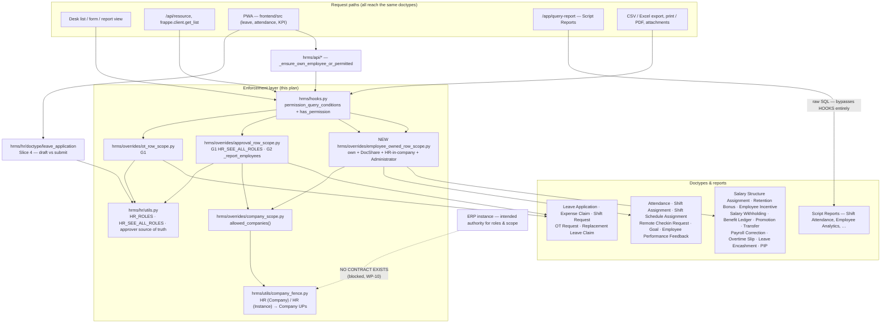

# Plan (v2, amended & approved) — carry the senior's required work from `as-hr_kpi` into v16, and close the inherited v16 defects

Branch: `nz-version-16` (verified active, `== origin/version-16`). Donor read-only at `.reference/hrms-as-hr_kpi/`.
Scope source: `docs/discovery/as-hr-kpi-to-v16-migration-plan.md` — 312 donor commits classified: 198 already satisfied, 4 forward-port (G1, G2, G4, G6), 2 reimplement (G3, G7), 1 blocked (G5).

## 0. Authorization model (mandatory — implement and test against this)

1. **ERP is authoritative** for user roles and allowed organizational scope.
2. **HRMS enforces effective roles and scopes independently on its backend.** Frontend restrictions are UX only.
3. Broad HR access only for ERP-authorized HR users, **limited to their authorized companies and source instances**.
4. Ordinary employees keep **self-service access to their own permitted records and workflows** — this is *not* "only HR may use HRMS".
5. **Seniority, designation or rank grants no HR authority.**
6. Managers/approvers receive **only explicitly authorized** subordinate, approval and company scope.
7. **`System Manager` is a technical role** — no automatic confidential HR-wide access.
8. **`Administrator`** retains exceptional framework authority; controlled and auditable.
9. **Missing, invalid or stale authorization fails closed** for sensitive access.

**External contract boundary (documented, not invented):** no ERP→HRMS role/scope synchronization exists in either branch — verified across `hrms/sync/` (mirrors four HR data doctypes, never roles or User Permissions) and `hrms/api/erp_instance.py` (PWA deep-link only). This work therefore secures HRMS against its **effective** local roles and scopes. End-to-end ERP provisioning and revocation is **runtime-unverified** and stays blocked (WP-10).

## Environment reality (decides what "verified" means)

`ruff` 0.15.9, `node` 22, `yarn` 1.22 available. Static tests **run in file mode** (`python3 hrms/tests/test_x.py`) — proven. No `frappe`, no bench, no site, no `pre-commit`. Permission/wiring/schema rules get **executable static tests**; database-dependent tests are written as bench tests and explicitly marked **runtime-unverified**.

---

## Slice 1 — WP-2: fence guard test (red first)
`hrms/tests/test_employee_role_fence_integrity.py`, pure static (JSON + AST over `hooks.py`). Fails when a doctype grants `Employee`/ESS a permlevel-0 right on an **employee-keyed** doctype without a row fence, `if_owner`, or a justified `FENCE_EXEMPT` entry. Its failure list is the Slice 2 work order.

## Slice 2 — WP-3: complete row-level enforcement (RC-A)

**Both paths, not one:** `permission_query_conditions` (list/query) **and** `has_permission` (direct REST document access, form loads, print/PDF, attachments, `frappe.client.get`). A query condition alone protects neither.

**Effective scope composes:**
- the employee's **own** records;
- records **explicitly shared** via DocShare (this is how the Remote Checkin approver path already works — `remote_checkin_request_hooks.py:221-239`);
- **separately authorized approver/manager scope** where the doctype defines one (none of the Slice-2 doctypes do; approver access arrives via DocShare);
- **HR within their authorized company/source scope** — HR is *not* implemented as blanket unrestricted: it composes with `overrides/company_scope.allowed_companies()`. For doctypes with no `company` field (e.g. Remote Checkin Request) the fence rides on the employee's company, matching `hrms/api/remote_checkin.py:107-135`. Source-instance scope rides on the same company User Permissions (registry-driven, `utils/company_fence.py`);
- **Administrator** exceptional authority, logged.

**Fail closed:** a user with no resolvable Employee and no shares gets `1=0`, not an open query.

**Evidence for safety:** 13 of the unfenced doctypes have zero `hrms/api` and zero PWA consumers; the rest read via session-employee-filtered APIs or HR-role roster paths.

**Scope, don't revoke** — whether an employee may read their own promotion letter is HR policy; own-record scoping closes the cross-employee leak without deciding it.

**Deliverables:** `hrms/overrides/employee_owned_row_scope.py`, `hooks.py` wiring, idempotent runtime patch (JSON perms are inert where Custom DocPerms exist — pattern: `patches/v15_99_0/staff_perm_lockdown.py`), static tests for wiring + guard, bench tests for list / direct record / API / export / print / attachment paths (runtime-unverified).

## Slice 3 — WP-4: Script Reports (RC-B), classified by HR purpose

All 12 staff-role reports are Script Reports: raw SQL, no row filtering, gated only by doctype-level `has_permission(ref_doctype, "report")`.

Classify each: **organization-wide HR operational → HR-only**; **employee self-service → explicitly self-scoped**; **manager → subordinate- and company-scoped**. **Fail closed while uncertain**, but do **not** permanently delete valid self-service behaviour merely because secure filtering needs more work — where self-service is legitimate and filtering is not yet implemented, restrict now and record the re-enablement as tracked debt.

Precedent, not invention: donor `a6084dd0f` did exactly this for the leave-balance reports; v16 already carries it. `Appraisal Overview` is already self-scoped (`appraisal_overview.py:77-82`).

## Slice 4 — WP-1: Leave Request drafts

- Employees **save drafts without a Leave Approver**.
- Mandatory-approver rule **enforced at submission** (`docstatus == 1`), preserving upstream intent from `c7fb62c05`.
- **One shared source of truth** for the UI approver selector and the backend validator.
- **Do not widen approval authority to ancestor departments.** *(Amendment — reverses the v1 plan.)* Evidence: `validate_staff_approver` (`hr/utils.py:930-953`) accepts only the employee's own department; `get_department_approvers` (`api/__init__.py:695-721`) walks the ancestor chain via `lft/rgt`. The narrow set is the fork's deliberate staff-lockdown boundary; the wide set is inherited upstream dropdown behaviour. Donor and v16 are byte-identical here, so there is **no donor evidence that ancestors were intended**. Therefore: **narrow the selector to the validator's set**, and record "may a parent-department approver approve?" as a **blocked policy decision**.

## Slice 5 — WP-5 / **G1** `87ae095e7`
`HR_SEE_ALL_ROLES = {HR User, HR Manager}` split from `HR_ROLES` for team-activity **read** scope. Implements model rule 7 — `System Manager` stops inheriting HR-wide visibility. Write-side fences keep `HR_ROLES`.

## Slice 6 — WP-6 / **G2** `acad140f8`
`_report_employees()` — managers read direct reports' requests, **read-only**, status-filtered both sides. **v16 adaptation:** composes with the company fence (model rule 6). Lands after G1.

## Slice 7 — **G6** `9a52eaa44` + **G7** `2614bd5ae`
G6 `description` on 6 appraisal child tables (schema-only; sequence against `.claude/plans/appraisal-achievement-scoring.md`). G7 reimplement the native `<input type="time">` branch on v16's diverged `FormField.vue` + port the donor's `.mjs` test.

## Slice 8 — **G4** `1cca17e28`, then **G3** `dbc63acd0`
Sequenced last, **not omitted**. G4: approvals history + Replacement Leave card. G3: team day view — every donor read is `ignore_permissions=True`, so the company fence must be added before porting. Proceed unless concrete evidence blocks them.

## Blocked (evidence recorded, nothing invented)
- **G5** OT grace window — HR/payroll sign-off.
- **WP-10** ERP role/scope contract — absent from both branches.
- Ancestor-department approval authority (Slice 4).
- Per-doctype HR policy: which own-records employees may read (Slice 2 leaves this open by scoping rather than revoking).

## FLOW

Derived from imports (no `.wiki/graph.json` present). Every arrow into the enforcement layer is a path an ordinary employee can reach today.

Two structural facts this graph encodes: the report path (`RPT`) **bypasses the hook layer entirely**, which is why Slice 3 must fix reports separately from Slice 2; and the ERP authority edge is **dashed because it does not exist** in either branch.

## MOCKUP

MOCKUP: NOT NEEDED (no new or redesigned UI surface). This slice set is backend authorization, row-scope enforcement, report gating and schema. The four user-visible effects all occur on **existing, unchanged screens**: a Leave Request draft now saves on the same form (validation timing only), the same approver dropdown lists a corrected set of options, `FormField.vue` swaps frappe-ui's `Input` for a native `<input type="time">` inside the existing field slot, and the appraisal child tables gain a standard Desk-rendered `description` column. Nothing changes layout, navigation or visual design, so there is no design contract to agree in advance. G3 (Team Day View) is the one genuinely new screen in the backlog; it is sequenced last and **will require its own mockup before implementation** — that is recorded as a gate on Slice 8.

## EXPECTED OUTPUT

**UI result (what a user sees afterwards)**
- An ordinary employee can **save a Leave Request draft without picking an approver**; the approver is required only when the request is submitted. The PWA approver dropdown offers exactly the approvers the backend will accept (no more "not one of your designated approvers" after a valid-looking pick).
- An ordinary employee **no longer sees other employees' records** in Desk lists, `/api/resource`, report view, CSV export, print/PDF or attachments for salary structure assignments, incentives, bonuses, withholdings, benefit ledgers, promotions, transfers, payroll corrections, overtime slips, leave encashments, PIPs, performance feedback, attendance, shift assignments and remote check-in requests. Their **own** records are unchanged.
- Organization-wide Script Reports (e.g. `Shift Attendance`, `Employee Analytics`) stop being openable by ordinary staff; HR output is unchanged.
- A user holding only `System Manager` **no longer sees other teams'** leave/expense/OT requests.
- A `reports_to` manager **gains read-only visibility** of their direct reports' requests, within their company fence.
- Appraisal child tables gain a `description` field; PWA time fields render a real time picker.

**Code changed**
- New: `hrms/overrides/employee_owned_row_scope.py`; patches under `hrms/patches/v16_0/`; tests `hrms/tests/test_employee_role_fence_integrity.py`, `test_report_role_integrity.py`, `test_employee_owned_row_scope.py`, `test_leave_draft_creation.py`, `test_manager_leave_visibility.py`, `frontend/tests/formfield-time-input.test.mjs`.
- Modified: `hrms/hooks.py` (row-scope wiring), `hrms/hr/utils.py` (`HR_SEE_ALL_ROLES`, shared approver source of truth), `hrms/overrides/approval_row_scope.py`, `hrms/overrides/ot_row_scope.py`, `hrms/hr/doctype/leave_application/leave_application.py`, `hrms/api/__init__.py`, report JSONs, 6 appraisal child-table JSONs, `frontend/src/components/FormField.vue`, `hrms/patches.txt`.

**How it ships**
- Doctype/report permission changes land as **idempotent runtime patches** registered in `patches.txt` (JSON perms are inert on sites carrying Custom DocPerms), applied by `bench migrate`; schema additions ship as doctype JSON + patch. Everything is one branch, `nz-version-16`, reviewable slice by slice.
- **Verification shipped with it:** runnable static tests (`python3 hrms/tests/test_*.py`) plus `ruff check`; bench-dependent tests are written and labelled **runtime-unverified** until a synthetic site exists.

## Guardrails
Only `nz-version-16` is modified; donor and baseline read-only. **No commit, no push.** Every slice: `ruff check` + runnable static tests; bench tests written and explicitly marked runtime-unverified. Traceability donor capability → v16 implementation → test is preserved. If a slice conflicts with the access model, depends on unknown HR policy, or needs the absent ERP contract, that slice stops and reports evidence while independent work continues.
