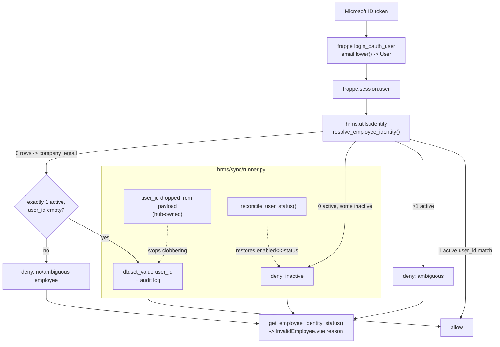

# Plan — fix the HRMS login/provisioning failure (`/hrms/invalid-employee`)

Branch `nz-version-16` (HEAD `e24f65975`, clean, in sync with origin). Bench at
`/home/nabil/verify-bench` (`fresh.local`, `test.local`).

## Root cause

HRMS has **no identity-resolution layer**. The only `User -> Employee` rule is a raw
`Employee.user_id == frappe.session.user AND status = 'Active'` query, duplicated across
13 call sites (7 with the status filter, 6 without). Consequences, all provable in-repo:

* **R1 — nothing ever establishes the link for an SSO user.** `frappe.utils.oauth.login_oauth_user`
  loads-or-creates a `User` from the Microsoft ID-token email and logs them in. HRMS then
  never reconciles that User with the Employee whose `company_email` is that same address.
  `Employee.user_id` blank (very common: ERP masters manage staff without portal users)
  means the person authenticates successfully and is bounced forever.
* **R2 — the mirror clobbers the link.** `hrms/sync/runner.py::_mirror_payload` copies
  `user_id` verbatim from the source ERP. Setting it by hand on this hub therefore survives
  only until the next incremental pull. *This is why a one-user database workaround is wrong.*
* **R3 — the mirror desyncs `User.enabled` from `Employee.status`.** `_write_row` updates via
  `frappe.db.set_value`, which skips `on_update` -> ERPNext's `update_user_status()` never
  runs. A Left employee keeps an enabled User: authenticates, then dead-ends. A reactivated
  one keeps a disabled User and cannot authenticate at all.
* **R4 — ambiguity resolves silently.** `_write_row` inserts with `ignore_validate=True`, so
  `validate_duplicate_user_id` never runs; `frappe.db.get_value` then picks whichever row
  comes first — the exact behaviour the brief forbids.
* **R5 — no diagnosis.** The PWA shows one generic dialog for all five causes and the server
  logs nothing.

The two `/api/method/login` 401s are **password attempts, not SSO**: `call("login", ...)` is
reachable only from `Login.vue`'s submit handler (grep: `session.js:28,33` are the sole
callers). An SSO-provisioned User is created with `"new_password": frappe.generate_hash()`,
so a password login by such a user can only ever 401.

## Fix — one canonical resolver, plus the two provisioning layers that break it

**NEW `hrms/utils/identity.py`** — the single mapping rule.

1. Normalize the session user (`strip().lower()`); Guest is denied.
2. Primary: Employees whose `user_id` normalizes to it. Exactly one **Active** -> allow.
   More than one -> **deny, ambiguous**. Zero active but some inactive -> **deny, inactive**.
3. Fallback, only to *establish* a permanent link, only when no Employee claims the user at
   all: exactly one **Active** Employee with `lower(trim(company_email))` equal to it **and**
   `user_id` empty. Writes `user_id` once via `db.set_value` (the documented
   `write_block` residual — the login mapping is hub-owned, not source-owned), and audit-logs
   it. Ambiguous or already-claimed -> deny.
   `personal_email` is deliberately **excluded**: it is a self-declared address, where
   `company_email` is the employer-controlled one an IdP assertion actually corresponds to.
4. Never grants a role. Never looks at an email domain. Never picks "the first match".

**`hrms/sync/runner.py`** — `LOCALLY_OWNED_FIELDS = {"Employee": ("user_id",)}`, dropped from
every mirrored payload (fixes R2), and `_reconcile_user_status()` after each Employee write to
restore the `User.enabled` <-> `Employee.status` invariant `db.set_value` skips (fixes R3).

**13 call sites** switched to the resolver, so inactive/ambiguous is denied everywhere and not
just at login (fixes the 6 status-less variants).

**`hrms/api/__init__.py`** — `get_current_employee_info` keeps its exact signature and
`None`-on-denial contract; new whitelisted `get_employee_identity_status()` returns the
non-sensitive reason for the denial page only.

**Frontend** — `InvalidEmployee.vue` shows the real reason; `mobile-web-app-capable` added
alongside the Apple meta; Leaflet CSS **and** JS moved from unpkg to the `leaflet` npm
package; `InstallPrompt.vue` null-guards `prompt()` and drops its console noise.

## FLOW



## MOCKUP

MOCKUP: NOT NEEDED (no new UI — the only user-visible change is the message string inside
the existing `Login Failed` dialog on `/hrms/invalid-employee`; no screen, route, component
or layout is added or altered). The before/after strings, in full:

```
+--------------------------------------------------+
|  Login Failed                                    |
|                                                  |
|  BEFORE (one message for all five causes):       |
|  "No active employee found associated with the   |
|   email ID a@x.com. Try logging in with your     |
|   employee email ID or contact your HR manager." |
|                                                  |
|  AFTER (the server's actual reason):             |
|   no_employee -> "Your account a@x.com is not    |
|     linked to an employee record. Ask HR to set  |
|     your company email on your employee record." |
|   inactive_employee -> "Your employee record is  |
|     not active. Contact your HR manager."        |
|   ambiguous_employee -> "Your account matches    |
|     more than one employee record. HR must       |
|     resolve the duplicate."                      |
|                                                  |
|                            [ Go to Login ]       |
+--------------------------------------------------+
```

No employee name, company or record ID appears in any message — only the caller's own email,
which they already know.

## EXPECTED OUTPUT

**UI result** — an ERP-provisioned employee whose Employee carries their `company_email` now
reaches `/hrms/home` on their first Microsoft login instead of `/hrms/invalid-employee`, and
the link persists across sync runs. Everyone genuinely ineligible still lands on the denial
page, now told which of the three reasons applies.

**Code changed** — new `hrms/utils/identity.py` and `hrms/tests/test_identity.py`;
`hrms/api/__init__.py`, `hrms/sync/runner.py`, the 11 other lookup call sites,
`frontend/src/views/InvalidEmployee.vue`, `frontend/index.html`,
`frontend/src/components/CheckInPanel.vue`, `frontend/src/components/InstallPrompt.vue`,
`frontend/package.json` + `yarn.lock`.

**How it ships** — one commit on `nz-version-16`, pushed. No patch: the link is established
lazily at login, so nothing needs migrating.

**Verification** — `hrms/tests/test_identity.py` covers the twelve personas in the brief
(ordinary, HR-with-company-scope, manager, senior non-HR, inactive, no-Employee, ambiguous,
alias/UPN mismatch, revoked role, cross-company, bad password, valid SSO). Regression: the
sync, write-block, company-fence, staff-lockdown, owned-row-scope, leave, KPI and team suites.
`ruff` (CI-pinned 0.3.7), `compileall`, `node --test`, `yarn build`, and `bench migrate` on
both `fresh.local` and `test.local`.

## Guardrails

Only `nz-version-16`. `version-16`, `version-15`, `as-hr_kpi` read-only. No force-push, no PR.
No blanket permissions, no role auto-assignment, no domain matching, no first-match selection,
no weakening of any backend authorization check. Synthetic accounts only — no production or
real employee data is read or written.
