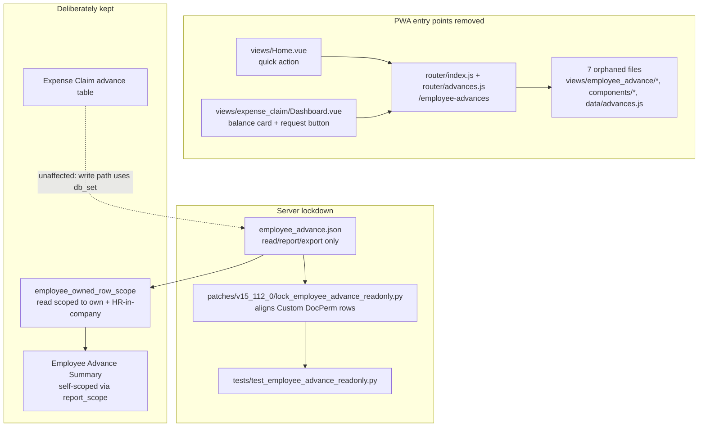

# Plan — port donor G8: remove employee advance requests

Branch: `nz-version-16` (HEAD `b38be575f`, clean, pushed). Donor `origin/as-hr_kpi` moved
`2fb61f399` → `a4debd2b6` (v15.111.1 → v15.112.0) with one substantive commit:
**`ddbdd6235 feat(hrms): remove employee advance requests`** (16 files, +111/−453).

## Why this is required, not optional

Company policy: staff may not request an advance and the company does not issue them.
The senior explicitly rejected a UI-only fix — *"Hiding the PWA buttons alone would have
been cosmetic — the routes stay reachable by deep link and the create API stays open."*

`nz-version-16` is entirely un-migrated: all PWA files present, and `Employee Advance`
still grants the `Employee` role `create` + `write`. Proven by running the donor's own
bench-free test against our JSON:

```
FAIL  Employee: create must be revoked — advances are not issued
FAIL  Expense Approver: create must be revoked — advances are not issued
```

So today a staff member can still create an advance via Desk or `/api/resource`.

## The one judgement call, and its evidence

**Keep `Employee Advance Summary` staff-visible, self-scoped.** The donor deliberately
keeps `read`/`report`/`export` on the doctype "so historical records stay visible to
reporting and to expense claims that reference them". A report showing the caller their
*own* advances is that same intent; making it HR-only would invent a stricter policy than
the senior wrote. My existing `utils/report_scope.apply_employee_scope` already pins it to
the caller.

## Work

1. **PWA removal** — delete `views/employee_advance/{Form,List}.vue`,
   `components/{EmployeeAdvanceBalance,EmployeeAdvanceItem}.vue`,
   `components/icons/EmployeeAdvanceIcon.vue`, `data/advances.js`, `router/advances.js`;
   strip the references in `components/ListView.vue`, `views/Home.vue`,
   `views/expense_claim/Dashboard.vue`. Keep the advance table inside the expense claim
   form so claims referencing an advance still render.
2. **Server lockdown** — harden `employee_advance.json` to read/report/export only, and
   port `patches/v15_112_0/lock_employee_advance_readonly.py` (Custom DocPerm rows ignore
   doctype JSON, so the patch aligns existing rows; it passes `if_owner` through because
   `update_permission_property` defaults it to 0 and would otherwise skip those rows).
3. **Test** — port `tests/test_employee_advance_readonly.py` (bench-free static check).

## v16 adaptations (the reason this is a port, not a cherry-pick)

- `frontend/src/router/index.js` — apply the advance-route removal **while keeping the
  `/team` route** added for G3.
- `hrms/patches.txt` — append after the two `v16_0` patches already added.
- `Home.vue` / `expense_claim/Dashboard.vue` / `ListView.vue` may have diverged from the
  donor; edit v16's versions rather than overwriting them.
- **Layering:** `overrides/employee_owned_row_scope.py` keeps `Employee Advance`. The
  donor leaves `read` org-wide; our fence narrows it to own records + HR-in-company, so
  the combination is strictly stronger than either alone. The fence-integrity guard still
  requires a fence because `read` remains — it is present, so the guard stays green.

## FLOW



## MOCKUP

MOCKUP: NOT NEEDED (this removes UI, it adds none). The visible change is the
disappearance of an existing quick action, card, button and route; no new screen,
layout or component is introduced, so there is no design contract to agree.

## EXPECTED OUTPUT

**UI result** — the Home "advance" quick action, the Expenses-dashboard advance balance
card and its request button, and the `/employee-advances` routes are gone. Deep-linking
to them no longer resolves. Expense claims that reference an advance still render their
advance table. Employees can still see their own advance history in the self-scoped
report.

**Code changed** — deleted: 7 PWA files. Modified: `router/index.js`, `Home.vue`,
`expense_claim/Dashboard.vue`, `ListView.vue`, `employee_advance.json`, `patches.txt`.
Added: `patches/v15_112_0/{__init__,lock_employee_advance_readonly}.py`,
`tests/test_employee_advance_readonly.py`.

**How it ships** — the JSON hardening reaches fresh installs; the patch aligns existing
sites' Custom DocPerm rows on `bench migrate`. One commit on `nz-version-16`, pushed.

**Verification** — donor's static test + my fence/report/doctype-permission guards +
`ruff` (CI-pinned 0.3.7) + `node --test` + `yarn build` (catches dangling imports from the
deletions) + fresh & upgraded `bench migrate` + patch idempotency + the affected bench
suites, on the disposable v16 site already built.

## Guardrails

Only `nz-version-16` is modified; `version-16`, `version-15`, `as-hr_kpi` stay read-only.
No force-push, no history rewrite. `.reference/` stays ignored.
