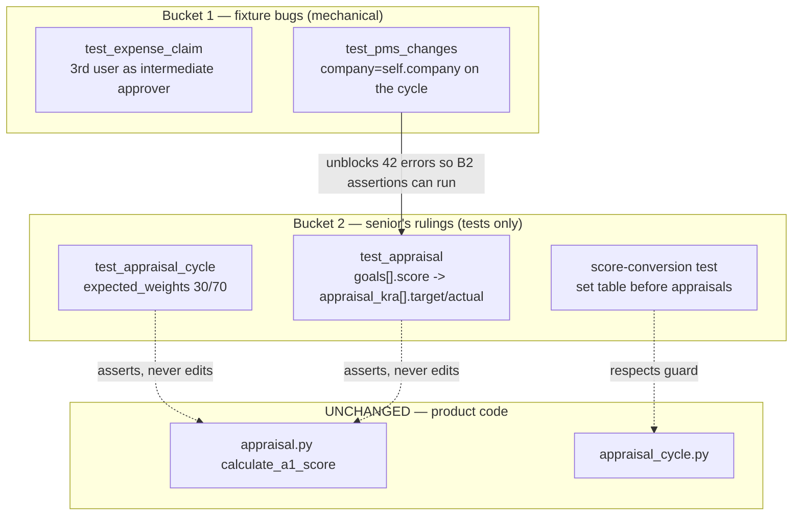

# Plan — close the recorded test debt (buckets 1 and 2), per the senior's rulings

Branch `nz-version-16` (HEAD `35281548c`, clean, pushed). Bench at `/home/nabil/verify-bench`
(`fresh.local`, `test.local`).

## Senior's rulings (received, and they decide bucket 2)

1. **KRA row weights stay summing to 100** — the code is authoritative, the test is stale.
2. **Rewrite the rating-driven appraisal tests around achievement.**
3. **Reorder the score-conversion-table test** rather than relax the guard.

No product behaviour changes. Every edit below is to a test or fixture; `appraisal.py`,
`appraisal_cycle.py` and the scoring model are not touched.

## Bucket 1 — provable fixture bugs

**B1a `test_expense_claim::test_expense_approver_perms`.** The test asserts *"changing the
approver revokes the previous approver's DocShare"* and picks `test@example.com` as the
intermediate approver purely for convenience. But `make_expense_claim` with no employee
argument selects the first active employee in `_Test Company` — `_T-Employee-00001`, whose
`user_id` **is** `test@example.com`. So the claim's own employee becomes their own approver
and the fork's staff-lockdown fence correctly throws. Self-approval is collateral, not the
assertion. Fix: a third, unrelated user for that step. The assertion is untouched.

**B1b `test_pms_changes`.** Employees are created in `create_company("_Test PMS")`, but
`create_appraisal_cycle` defaults to `company = "_Test Appraisal"`, and
`get_employees_for_appraisal` filters on company — so zero appraisees, hence 42 ×
"Please select employees to create appraisals for". Fix: pass `company=self.company` at the
call sites in that suite. Verified this is the only suite with the mismatch; the other four
callers already use `_Test Appraisal`, which matches the default.

## Bucket 2 — per the rulings

**B2a `test_appraisal_cycle::test_create_appraisals`** — `expected_weights` becomes
`[30.0, 70.0]` and the stale comment goes. Ruling 1: template goals already sum to 100 and
are copied verbatim (`set_kras_and_rating_criteria`: *"Template goals already sum to 100% —
copy directly"*); the Section-A 70% is applied later in `calculate_a1_score`
(`a1_score = min(conversion / 0.80 * a1_weight, a1_weight)`). `validate_total_weightage(...100)`
independently confirms rows must sum to 100, which 21+49=70 would fail.

**B2b `test_appraisal.py`** — rewrite around achievement. These tests drive
`appraisal.goals[i].score` and assert `score_earned` / `total_score`, but the fork **never
populates the legacy `goals` table** (no `self.set("goals", …)` anywhere in `appraisal.py`),
which is why they raise `IndexError: list index out of range`. Scoring is entirely
`appraisal_kra` + achievement:

```
achievement    = actual / target * 100        (capped at 100)
rating_value   = capped / 100 * 5
weighted_score = per_weightage * rating_value / 5
weighted_avg   = weighted_sum / total_weightage * 5
a1_score       = min(conversion / 0.80 * a1_weight, a1_weight)
```

So the tests set `target`/`actual` on `appraisal_kra` rows and assert `weighted_score` and
`a1_score`. The docstring's own worked example — all KRAs at 100% achievement, A1=70 →
`(0.80/0.80) × 70 = 70` — is the anchor case.

**B2c** — reorder the score-conversion-table test so the table is set **before** appraisals
exist, respecting the guard rather than weakening it.

## FLOW



## MOCKUP

MOCKUP: NOT NEEDED (no UI). Every change is to a Python test or fixture; no screen,
component, route or user-visible behaviour is added or altered.

## EXPECTED OUTPUT

**UI result** — none. No product behaviour changes; appraisal scores, weights and
permissions are all computed exactly as they are today.

**Code changed** — `hrms/hr/doctype/expense_claim/test_expense_claim.py`,
`hrms/hr/doctype/appraisal/test_pms_changes.py`,
`hrms/hr/doctype/appraisal_cycle/test_appraisal_cycle.py`,
`hrms/hr/doctype/appraisal/test_appraisal.py`. No non-test module is touched — that is the
check that ruling 1 was honoured.

**How it ships** — one commit on `nz-version-16`, pushed. Nothing to migrate.

**Verification** — the previously red suites go green on `fresh.local`:
`test_expense_claim`, `test_appraisal`, `test_appraisal_cycle`, `test_pms_changes`, plus
`test_kpi`, `test_appraisal_overview`, `test_employee_performance_feedback`,
`test_appraisal_template` as regression. Guards (`fence`, `report-role`,
`doctype-permission`, `write_block`) and `ruff` (CI-pinned 0.3.7) stay green.

## Guardrails

Only `nz-version-16`. `version-16`, `version-15`, `as-hr_kpi` read-only. No force-push.
**No assertion is weakened to obtain green** — B2a changes an expected value only because
the senior ruled the code authoritative and two independent code paths agree with it; if
any suite still fails for a reason that implies a product defect, I stop and report rather
than adjust the number.
