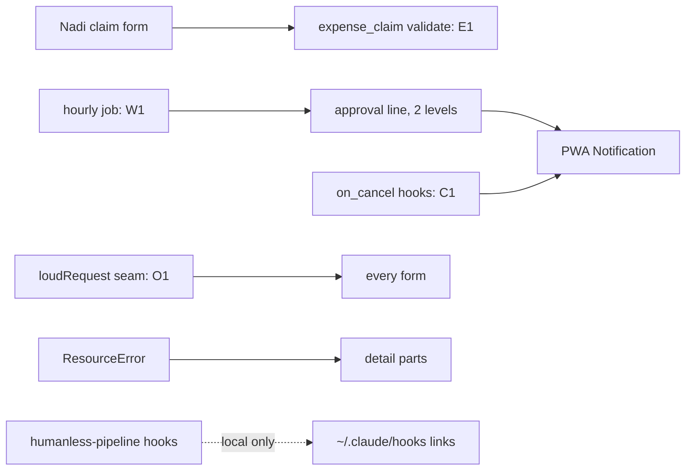

# Release 2.0.0-alpha.38 "Money and Waiting" (planned and approved 6 Oct 2026)

Owner, 6 Oct: "plan for next release, what is the biggest one we need to do including my call. No push,
anything regarding pipeline. We stay local."
Reading of "stay local": pipeline work (humanless-pipeline, ~/.claude hooks) is committed locally and never
pushed. The app release push waits for the owner's word too (asked in the reply).

## Lenses (deep-analysis, short)
- First principles: people must never be paid twice, and a request must never wait on someone who is away.
- Assumptions: "approver on leave" stalls are reported by people, not measured; duplicates need a rule for
  what "the same claim" is (same person, type, date, amount).
- Experts: finance says block exact duplicates; HR says warn on near ones (two real taxis on one day happen).
- Simple: a second identical claim is stopped like a second card swipe; a request whose approver is away
  moves up the line after a set number of days.
- Critique: reports fencing was deferred on 13 Sep; HR now sees all companies by ruling (23 Sep), so most
  report exposure is closed by that ruling. Re-probe only for approver roles; not a blind 40-report rewrite.
- Steps: rulings first, then money (E1), waiting (W1), notices (C1), then leftovers and pipeline.

## FLOW
Same as alpha.35-37: Opus orchestrator briefs -> Sonnet implementer (xhigh) builds test-first, commits nothing
-> orchestrator reviews, proves red/green (live for UI), commits one cause per commit -> reviewer -> next.

```mermaid
graph LR
  NadiForm[Nadi claim form] --> ExpenseClaim[expense_claim validate: E1]
  Scheduler[hourly job: W1] --> ApprovalLine[approval line, 2 levels] --> Notice[PWA Notification]
  Cancel[on_cancel hooks: C1] --> Notice
  loudRequest[loudRequest seam: O1] --> Forms[every form]
  ResourceError --> L1[detail parts]
  H1[humanless-pipeline hooks] -.local only.-> ClaudeHooks[~/.claude/hooks links]
```

## THE BIGGEST ONE: E1 duplicate Expense Claim (money; ruling 1)
Expense Claim has no duplicate guard (stabilise plan Stage 1.2). A slow network plus a second tap, or a
re-file, can pay the same receipt twice. Rule (proposed): same employee + expense type + expense date +
amount on a claim not Cancelled/Rejected = duplicate. Ruling 1 decides block or warn.
Files: hrms/hr/doctype/expense_claim (validate) + the Nadi claim form. Test: red stub test filing the same
claim twice; live: file twice in Nadi.

## NEEDS YOUR CALL (each one changes what gets built)
R1  Duplicate expense claim: (a) block exact duplicates, warn near ones [recommended] (b) warn only (c) block only.
R2  Approver on leave: (a) after N working days the request moves to the next level of the line, both told
    [recommended, N=2] (b) it waits, the approver's manager is told (c) nothing changes.
R3  Cancel after approval: (a) approver and HR are told, balance/attendance reverse as today [recommended]
    (b) HR only (c) nobody (today, for most types).
R4  Offline submit: (a) a clear "Not sent: you are offline. Your form is kept." and nothing queued
    [recommended] (b) a real send-later queue (bigger, own release).
R5  Reports (deferred 13 Sep): (a) probe only the approver roles' reports on real data, fix what leaks
    [recommended] (b) still deferred.
R6  Pipeline hooks (local only): (a) move the 25 hooks that point at the old /opt/keel copy onto the
    pipeline repo, one at a time, each with its own tests, never pushed [recommended] (b) leave them.

## SLICES (built after the rulings; one cause per commit; reviewed)
E1  duplicate Expense Claim guard (per R1).
W1  approver-away escalation (per R2): scheduled job + notice; uses the existing approval line (2 levels).
C1  cancel-after-approval notices (per R3) for Leave, OT, Expense, Attendance Request, Shift Request.
O1  offline submit says so (per R4): one seam (loudRequest) for every form.
L1  leftovers from alpha.37: the second "Something didn't load" toast after "You can't open this";
    4 parts blank on a failed load (RequestTimeline, ExpensesTable, ExpenseTaxesTable, MustReadNotice).
P1  report probe (per R5): approver roles, real rows on fresh.local, rolled back.
H1  pipeline hooks: ON HOLD (6 Oct, found while starting). /opt/keel is NOT an old copy of humanless-pipeline:
    the two repos forked at 75e46ca and each has ~70 commits the other lacks (keel: usage cutover, learnings,
    security push gate, key guard, Sep 21-Oct 5; pipeline: commit-scope, tdd paths, Sep 7-Oct 6). Re-linking a
    hook to humanless-pipeline would DROP keel's newer work in that hook. Ruling R6 ("move them") assumed the
    opposite. Needs a new owner call: which repo is the source of truth, then port the missing fixes INTO it.
    The pre-commit-lint re-link of alpha.37 stays (pipeline's version is a superset there, reviewed).

S1  **SOPs: HR writes them the way staff read them** (owner, 6 Oct: "make SOP works, visible to everyone as how
    HR use it ... displayed correctly or at least HR configure the way it should be"). Probed 6 Oct on fresh.local
    as staff, supervisor and HR: who sees what is CORRECT (staff: General + own department + own company; HR: all,
    drafts too), lists and detail render headings, lists, bold, tables, private and public pictures.
    BROKEN: HR's edit sheet in Nadi is a plain textarea fed the stored HTML, so HR sees raw code
    ("
Private picture:
") and a save from it keeps or mangles it; HR cannot add a heading,
    list, bold or picture from Nadi at all; the preview of what staff will see is missing.
    Fix: the edit sheet uses a rich editor (frappe-ui TextEditor, already installed, already in the tailwind
    content list) with headings / lists / bold / link / picture, the same safeHtml allow-list on read; an
    "As staff see it" preview; who-sees-it line under Scope ("Everyone in <company>" / "Only <department>").
    DONE WHEN: HR edits an existing SOP in Nadi and sees formatted text, not code; saves; staff see the same
    formatting (Playwright as HR then as staff); safeHtml unchanged; no new dependency.
N1  **Near-duplicate expense warning in Nadi** (owner yes, 6 Oct): after save, the Nadi claim form shows the
    server's orange warning (today only Desk shows it). One place: the form's save path reads frappe-ui's
    message log. DONE WHEN: live, a same-day same-type claim shows the warning in Nadi.
K1  **Pipeline: /opt/keel is the source of truth** (owner yes, 6 Oct). Port the humanless-pipeline-only fixes
    (commit-scope staging, e2e spec skip, ceiling rot reads wrapped lines, tdd paths) INTO keel, one at a time
    with its tests; then point ~/.claude/hooks at keel. LOCAL ONLY. Needs write access to /opt/keel (owner).

## NOT IN THIS RELEASE
Token debt (234), hand-made controls (25), Android gate, send-later queue (if R4b), hrms/api/__init__.py split.

## MOCKUP: NOT NEEDED (no new screen: one refusal sentence on an existing form, one notice line, one banner sentence)

## EXPECTED OUTPUT
6-8 app commits + local pipeline commits; frontend + python stub suites green; live checks for E1 and O1.
No push of anything until the owner says.
